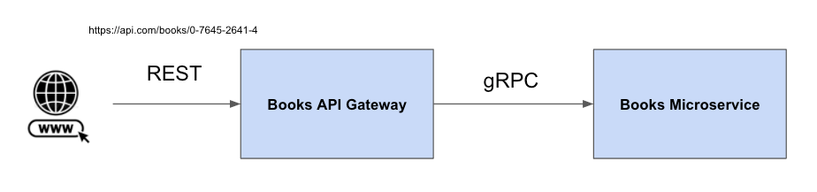
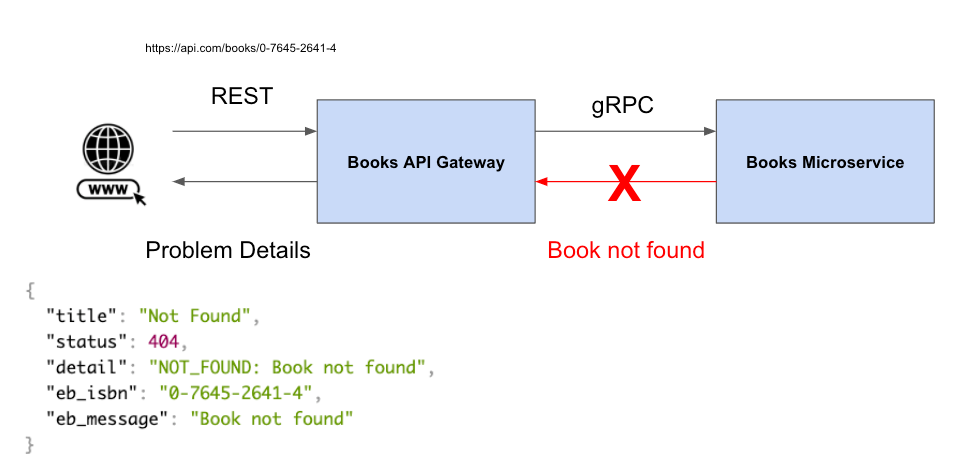

# Error handling in gRPC with public RESTFul API using Problem Details

Dealing with errors in gRPC it could be hard, because the current version of gRPC it's very simple based on some status codes and metadata. You can read more about errors in gRPC in the next [link](https://www.grpc.io/docs/guides/error/)

In this repo you will find a PoC that consists in one api gateway and a microservice that returns books by ISBN:

* The books' gateway is the client of the books microservice and expose the information through a REST API. In a more advance scenario it could be a BFF consuming more microservices but for the sake of simplicity I decided to consume only one.
* The books' microservice that expose a gRPC API to get books.

When you get a book by invalid ISBN, the books' microservice will throw and exception and the client application (Books' aPI Gateway) should handler the error showing a meaningful error response to the caller.

To provide this meaningful error messages to the caller, I decided to use [Problem Details](https://datatracker.ietf.org/doc/html/rfc7807), a standard way of specifying errors in HTTP API response. For this example I've used this [library](https://github.com/zalando/problem-spring-web) developed by Zalando

